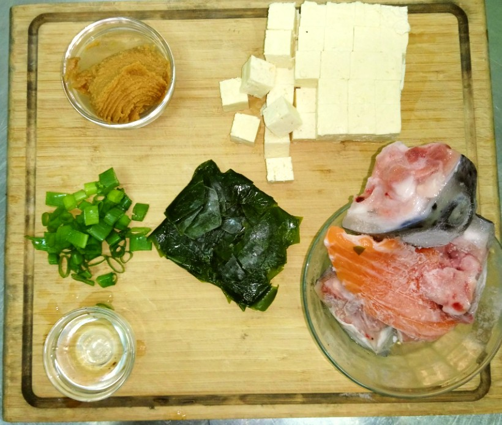
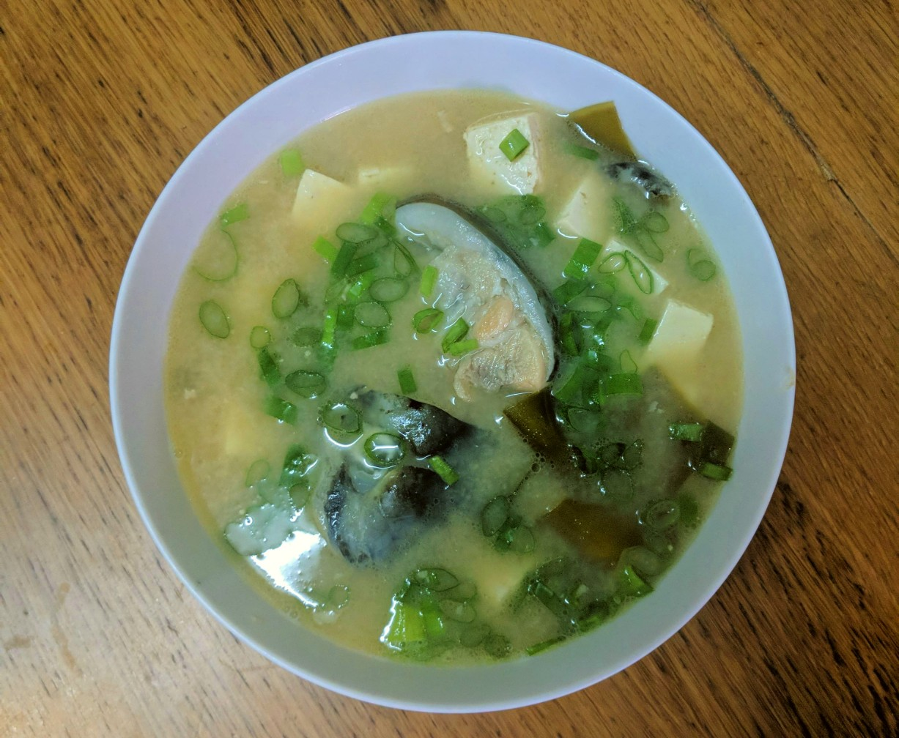

# 鮭魚豆腐味噌湯

## 食材 { #ingredients }

  - 鮭魚頭 (混龍骨) 300 克
  - 豆腐 1 塊 (切丁)
  - 料理米酒 30 ml (去腥)
  - 蔥綠 2 段 (切末)
  - 新鮮海帶 40 克
  - 味噌 60 克
  - 水 2000 ml

## 步驟 { #directions }

  - 水滾後放鮭魚、米酒、豆腐、海帶。
  - 再次水滾後轉中小火煮 20 分。
  - 加入味噌後，再滾 10 分。
  - 加入蔥末，30 秒後起鍋。

## 參考資料 {: #reference }

  - [🐟鮭魚豆腐味噌湯 by 小毓の饗樂廚房🍳 \- 愛料理](https://icook.tw/recipes/268474)
