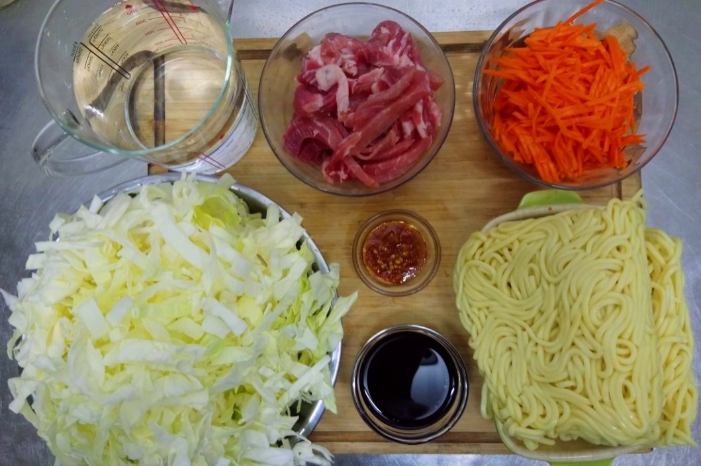
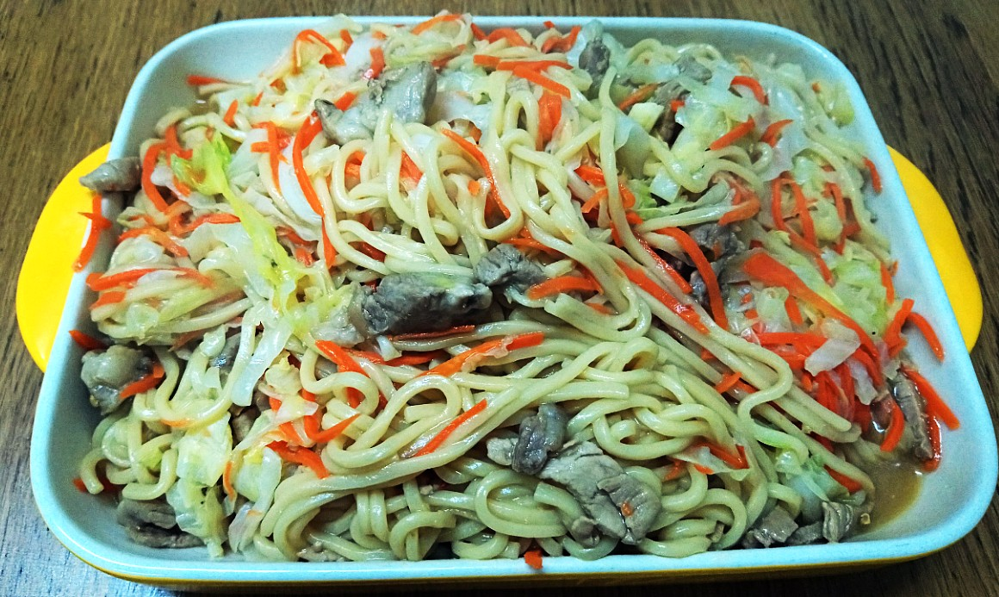

# 台式炒麵

## 食材 { #ingredients }

  - 胡蘿蔔 1 條 110g (刨絲)
  - 高麗菜 1/4 顆 500g (切絲)
  - 木耳 10 克 (切絲)
  - 梅花豬肉 200g (切絲)
  - 醬油 50 ml
  - 辣椒醬 2 小匙
  - 水 500 ml

## 步驟 { #directions }

  - 汆燙高麗菜、胡蘿蔔、木耳，使其軟化後備用。
  - 讓油麵過一下熱水去油，之後也比較容易拌開。
  - 中華炒鍋加水 500 ml，加入辣椒醬後煮滾。
  - 煮水的同時，用平底鍋乾炒肉絲，加醬油爆香後，倒進中華炒鍋。
  - 加入麵條並持續翻動鍋子，待湯汁快收乾時，拌入汆燙好的蔬菜。

