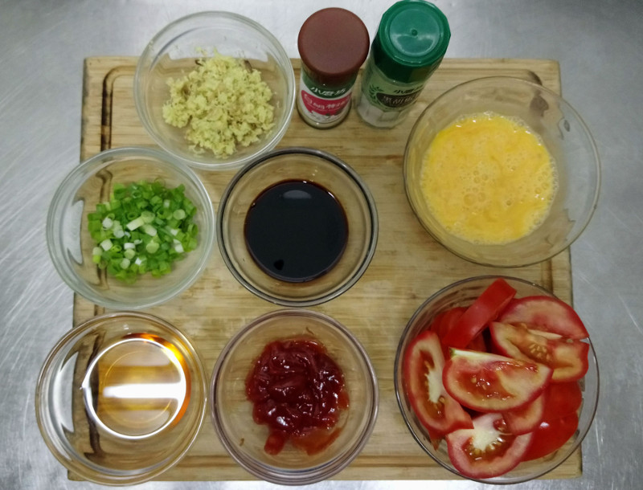
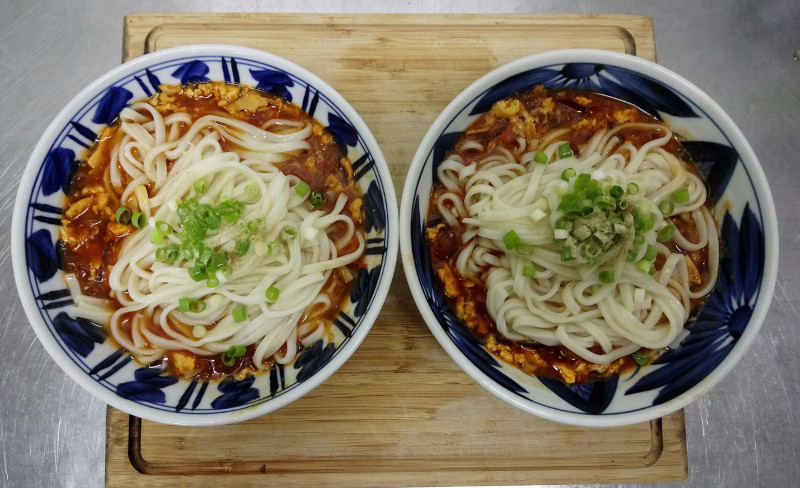

# 番茄雞蛋麵

## 食材

  - 麵條 2 人份
  - 雞蛋 2 顆
  - 牛番茄 2 顆 (對半再切片)
  - 番茄醬 35 克
  - 老薑 20 克 (磨末)
  - 香油 25 ml
  - 醬油 30 ml
  - 白胡椒
  - 水 2600 ml
  - 蔥花
  - 鹽
  - 紅砂糖 1 小匙

## 步驟

 1. 湯鍋煮水 2600 ml 備用。
 2. 用香油 1/3 拌抄蛋液 1/2，熟了之後取出備用。
 3. 用香油 1/3、薑末拌抄番茄，之後依序加入番茄醬、醬油拌抄。
 4. 取湯鍋滾水 600 ml 放入炒鍋，加入炒蛋、白胡椒、糖燉煮。
 5. 湯鍋加入少許鹽後煮麵。
 6. 麵煮熟後，先在炒鍋淋上蛋液 1/2 再分裝，加入麵條、撒上蔥花、白胡椒，最後淋上少許香油 1/3。

## 參考資料

  - [【姆士流】番茄雞蛋麵 \- YouTube](https://www.youtube.com/watch?v=NrAb7ZWgFCY) #ril
